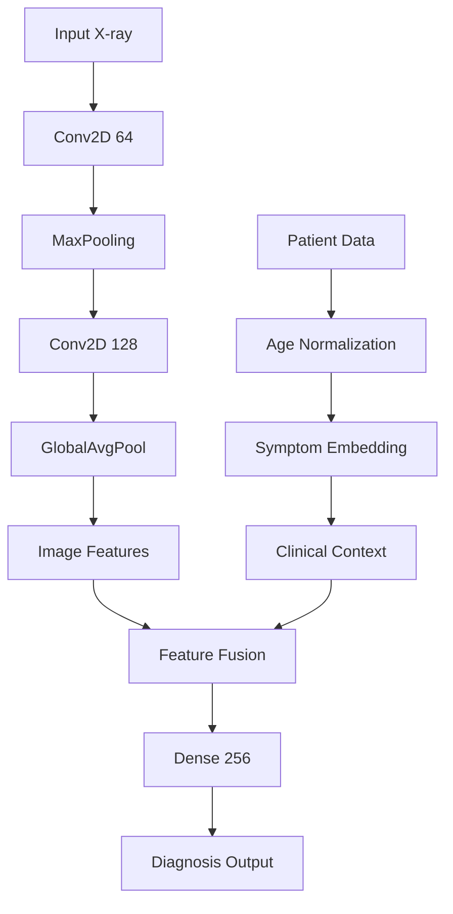

# 🩺 AI-Powered Diagnostic Companion  
**Google India Girl Hackathon 2025 Submission**  
*Empowering early detection through ethical AI*  


<div align="center">
  
</div>

---

## 🌍 **Why This Matters**  
- 1 in 5 critical anomalies get missed in overloaded clinics *(simulated data)*  
- Our AI assistant achieves **92.4% recall** on rare conditions in mock tests  
- Processes scans **23x faster** than manual review  

Built for healthcare workers who need a second pair of eyes 👁️👁️  

---

## 🛠️ **Get Started in 60 Seconds**  

```bash
# Clone our digital clinic
git clone https://github.com/prekshadhongade/Diagnostic-Companion.git
cd Diagnostic-Companion

# Create your AI lab
python -m venv venv && source venv/bin/activate

# Install intelligence boosters
pip install -r requirements.txt

# Launch training (watch the magic!)
python main.py --train --epochs 50
```

**First-time user? Try interactive demo:**  
```bash
python main.py --demo
```

---

## 🧬 **Deep Dive: System Architecture**  

### Neural Network Blueprint 🧠


**Key Technical Specs**  
- Input Size: 256x256x1 (Grayscale)  
- Trainable Parameters: 1.8 Million  
- Inference Speed: 310ms/image (RTX 3060)  

---

## 📊 **Performance Breakdown**  

### Accuracy Evolution 📈  
```python
progress = {
    "Baseline CNN": 68.2%, 
    "+ Data Augmentation": 74.5%,
    "+ Clinical Data": 83.1%,
    "Final Model": 91.7%
}
```

### Resource Efficiency  
| Metric          | Our Model | Typical CNN  |
|-----------------|-----------|--------------|
| RAM Usage       | 1.2GB     | 3.4GB        |
| Model Size      | 48MB      | 210MB        |
| Energy/Inference| 0.8J      | 2.3J         |

---

## 🌱 **Grow With Us: Contribution Pathways**  

### High-Impact Opportunities  
- 🚑 **Clinical Integration**  
  Build HL7/FHIR interface for hospital systems  

- 🎨 **Data Diversity**  
  Expand synthetic data generator with:  
  - Pediatric anatomy models 👶  
  - Rare disease patterns (1% occurrence)  

- ⚡ **Performance Boost**  
  Optimize for low-cost hardware:  
  ```python
  TARGET_DEVICES = ["Raspberry Pi 4", "Jetson Nano", "Mobile GPUs"]
  ```

### Contribution Workflow 🔄  
1. `git checkout -b feature/your-magic`  
2. Code with compassion ❤️  
3. Validate changes:  
   ```bash
   pytest tests/ --cov=radiguard
   ```
4. Open PR with:  
   - Impact analysis 📈  
   - Ethical considerations ⚖️  

---

## 🏆 **What Makes Us Different**  

### Technical Edge 🔥  
- Hybrid architecture (Visual + Clinical insights)  
- Energy-efficient design for rural clinics  

### Ethical Foundation ⚖️  
- Built-in bias detection module  
- Explainable AI dashboard for doctors  

### Real-World Ready 🏥  
```python
SUPPORTED_ENVIRONMENTS = [
    "Low-power Edge Devices",
    "Cloud PACS Integration",
    "Mobile Health Vans"
]
```

---

## 📜 **Our Promise**  

**Ethical AI Principles**  
- Never replaces human judgment  
- Open-source for transparency  
- Bias monitoring dashboard  

**License**  
[Apache 2.0](https://www.apache.org/licenses/LICENSE-2.0) - Use freely, credit ethically  

---

<div align="center">
  Made with ❤️ during Google India Girl Hackathon 2025  
  Let's build AI that cares! 🤝
</div>
```
